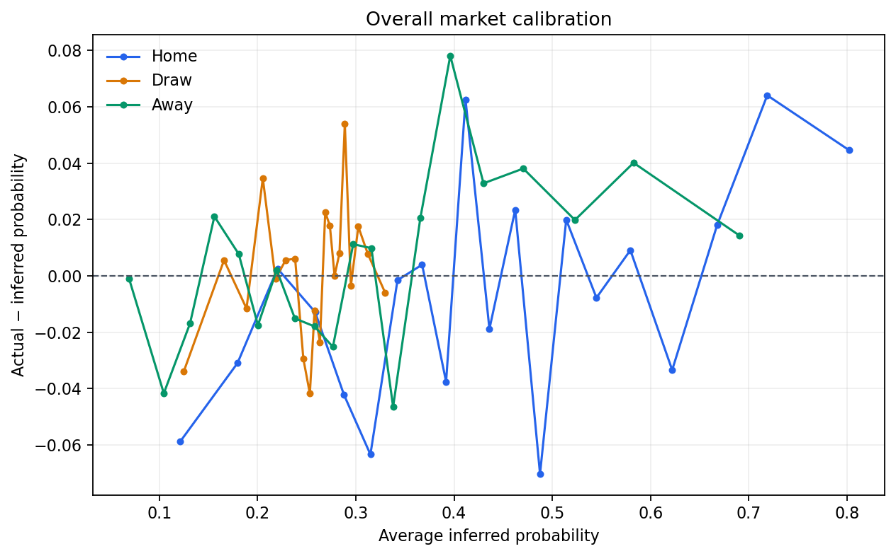
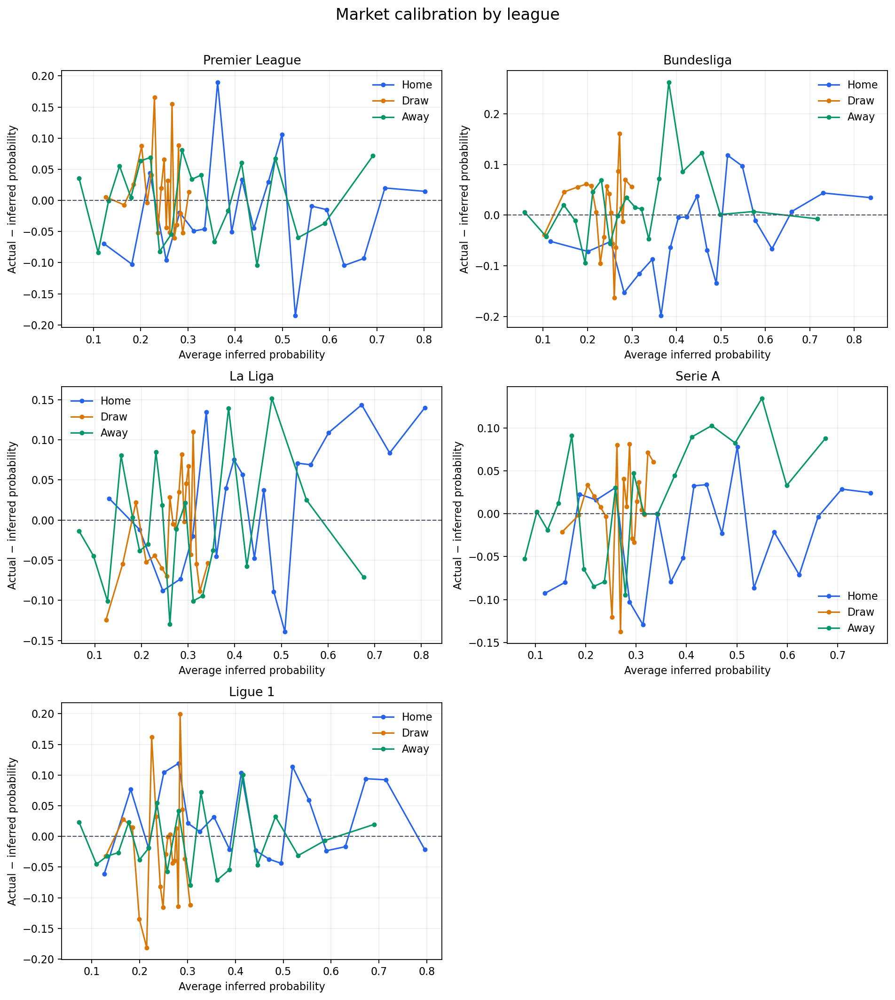
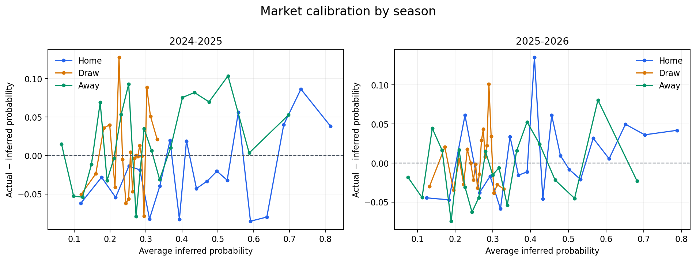

# Report 01 — Market Calibration

## Research question

How well do normalized average closing 1X2 market probabilities match observed Home / Draw / Away frequencies, and is the pattern stable across leagues and seasons?

## Dataset and method

The analysis uses all 3,504 Big Five matches from 2024-2025 and 2025-2026. For each match, inverse Home / Draw / Away closing odds are normalized to sum to one, removing the bookmaker overround. Each outcome is grouped into 20 quantile bins, so bins have similar sample sizes. Error is `actual probability - average inferred probability`.

## Overall calibration

### Home

| outcome | bin | avg_pred | actual | error | count |
| --- | ---: | ---: | ---: | ---: | ---: |
| home | 1 | 0.121 | 0.062 | -0.059 | 176 |
| home | 2 | 0.180 | 0.149 | -0.031 | 175 |
| home | 3 | 0.220 | 0.223 | 0.003 | 175 |
| home | 4 | 0.259 | 0.246 | -0.013 | 175 |
| home | 5 | 0.288 | 0.246 | -0.042 | 175 |
| home | 6 | 0.315 | 0.251 | -0.063 | 175 |
| home | 7 | 0.342 | 0.341 | -0.002 | 176 |
| home | 8 | 0.367 | 0.371 | 0.004 | 175 |
| home | 9 | 0.392 | 0.354 | -0.038 | 175 |
| home | 10 | 0.412 | 0.474 | 0.063 | 175 |
| home | 11 | 0.436 | 0.417 | -0.019 | 175 |
| home | 12 | 0.462 | 0.486 | 0.023 | 175 |
| home | 13 | 0.488 | 0.417 | -0.070 | 175 |
| home | 14 | 0.514 | 0.534 | 0.020 | 176 |
| home | 15 | 0.545 | 0.537 | -0.008 | 175 |
| home | 16 | 0.579 | 0.589 | 0.009 | 175 |
| home | 17 | 0.622 | 0.589 | -0.033 | 175 |
| home | 18 | 0.668 | 0.686 | 0.018 | 175 |
| home | 19 | 0.719 | 0.783 | 0.064 | 175 |
| home | 20 | 0.802 | 0.847 | 0.045 | 176 |

### Draw

| outcome | bin | avg_pred | actual | error | count |
| --- | ---: | ---: | ---: | ---: | ---: |
| draw | 1 | 0.125 | 0.091 | -0.034 | 176 |
| draw | 2 | 0.166 | 0.171 | 0.006 | 175 |
| draw | 3 | 0.189 | 0.177 | -0.012 | 175 |
| draw | 4 | 0.205 | 0.240 | 0.035 | 175 |
| draw | 5 | 0.218 | 0.217 | -0.001 | 175 |
| draw | 6 | 0.229 | 0.234 | 0.006 | 175 |
| draw | 7 | 0.238 | 0.244 | 0.006 | 176 |
| draw | 8 | 0.247 | 0.217 | -0.029 | 175 |
| draw | 9 | 0.253 | 0.211 | -0.042 | 175 |
| draw | 10 | 0.258 | 0.246 | -0.012 | 175 |
| draw | 11 | 0.264 | 0.240 | -0.024 | 175 |
| draw | 12 | 0.269 | 0.291 | 0.023 | 175 |
| draw | 13 | 0.274 | 0.291 | 0.018 | 175 |
| draw | 14 | 0.278 | 0.278 | 0.000 | 176 |
| draw | 15 | 0.283 | 0.291 | 0.008 | 175 |
| draw | 16 | 0.289 | 0.343 | 0.054 | 175 |
| draw | 17 | 0.295 | 0.291 | -0.004 | 175 |
| draw | 18 | 0.303 | 0.320 | 0.017 | 175 |
| draw | 19 | 0.312 | 0.320 | 0.008 | 175 |
| draw | 20 | 0.330 | 0.324 | -0.006 | 176 |

### Away

| outcome | bin | avg_pred | actual | error | count |
| --- | ---: | ---: | ---: | ---: | ---: |
| away | 1 | 0.069 | 0.068 | -0.001 | 176 |
| away | 2 | 0.105 | 0.063 | -0.042 | 175 |
| away | 3 | 0.131 | 0.114 | -0.017 | 175 |
| away | 4 | 0.156 | 0.177 | 0.021 | 175 |
| away | 5 | 0.181 | 0.189 | 0.008 | 175 |
| away | 6 | 0.200 | 0.183 | -0.018 | 175 |
| away | 7 | 0.220 | 0.222 | 0.002 | 176 |
| away | 8 | 0.238 | 0.223 | -0.015 | 175 |
| away | 9 | 0.258 | 0.240 | -0.018 | 175 |
| away | 10 | 0.277 | 0.251 | -0.025 | 175 |
| away | 11 | 0.297 | 0.309 | 0.011 | 175 |
| away | 12 | 0.316 | 0.326 | 0.010 | 175 |
| away | 13 | 0.338 | 0.291 | -0.047 | 175 |
| away | 14 | 0.366 | 0.386 | 0.021 | 176 |
| away | 15 | 0.396 | 0.474 | 0.078 | 175 |
| away | 16 | 0.430 | 0.463 | 0.033 | 175 |
| away | 17 | 0.470 | 0.509 | 0.038 | 175 |
| away | 18 | 0.523 | 0.543 | 0.020 | 175 |
| away | 19 | 0.583 | 0.623 | 0.040 | 175 |
| away | 20 | 0.690 | 0.705 | 0.014 | 176 |

## By league

### Premier League

| league | outcome | bin | avg_pred | actual | error | count |
| ---: | --- | ---: | ---: | ---: | ---: | ---: |
| Premier League | home | 1 | 0.122 | 0.053 | -0.069 | 38 |
| Premier League | home | 2 | 0.181 | 0.079 | -0.102 | 38 |
| Premier League | home | 3 | 0.219 | 0.263 | 0.044 | 38 |
| Premier League | home | 4 | 0.254 | 0.158 | -0.096 | 38 |
| Premier League | home | 5 | 0.283 | 0.263 | -0.019 | 38 |
| Premier League | home | 6 | 0.312 | 0.263 | -0.049 | 38 |
| Premier League | home | 7 | 0.335 | 0.289 | -0.046 | 38 |
| Premier League | home | 8 | 0.363 | 0.553 | 0.190 | 38 |
| Premier League | home | 9 | 0.393 | 0.342 | -0.051 | 38 |
| Premier League | home | 10 | 0.414 | 0.447 | 0.033 | 38 |
| Premier League | home | 11 | 0.439 | 0.395 | -0.045 | 38 |
| Premier League | home | 12 | 0.470 | 0.500 | 0.030 | 38 |
| Premier League | home | 13 | 0.499 | 0.605 | 0.106 | 38 |
| Premier League | home | 14 | 0.527 | 0.342 | -0.185 | 38 |
| Premier League | home | 15 | 0.562 | 0.553 | -0.009 | 38 |
| Premier League | home | 16 | 0.594 | 0.579 | -0.015 | 38 |
| Premier League | home | 17 | 0.631 | 0.526 | -0.105 | 38 |
| Premier League | home | 18 | 0.672 | 0.579 | -0.093 | 38 |
| Premier League | home | 19 | 0.717 | 0.737 | 0.020 | 38 |
| Premier League | home | 20 | 0.801 | 0.816 | 0.015 | 38 |
| Premier League | draw | 1 | 0.126 | 0.132 | 0.006 | 38 |
| Premier League | draw | 2 | 0.165 | 0.158 | -0.007 | 38 |
| Premier League | draw | 3 | 0.185 | 0.211 | 0.026 | 38 |
| Premier League | draw | 4 | 0.202 | 0.289 | 0.087 | 38 |
| Premier League | draw | 5 | 0.214 | 0.211 | -0.003 | 38 |
| Premier League | draw | 6 | 0.222 | 0.263 | 0.041 | 38 |
| Premier League | draw | 7 | 0.229 | 0.395 | 0.166 | 38 |
| Premier League | draw | 8 | 0.236 | 0.184 | -0.052 | 38 |
| Premier League | draw | 9 | 0.243 | 0.263 | 0.020 | 38 |
| Premier League | draw | 10 | 0.250 | 0.316 | 0.066 | 38 |
| Premier League | draw | 11 | 0.254 | 0.211 | -0.044 | 38 |
| Premier League | draw | 12 | 0.258 | 0.289 | 0.032 | 38 |
| Premier League | draw | 13 | 0.262 | 0.211 | -0.051 | 38 |
| Premier League | draw | 14 | 0.266 | 0.421 | 0.155 | 38 |
| Premier League | draw | 15 | 0.271 | 0.211 | -0.060 | 38 |
| Premier League | draw | 16 | 0.276 | 0.237 | -0.039 | 38 |
| Premier League | draw | 17 | 0.280 | 0.368 | 0.088 | 38 |
| Premier League | draw | 18 | 0.284 | 0.263 | -0.021 | 38 |
| Premier League | draw | 19 | 0.289 | 0.237 | -0.052 | 38 |
| Premier League | draw | 20 | 0.302 | 0.316 | 0.014 | 38 |
| Premier League | away | 1 | 0.070 | 0.105 | 0.036 | 38 |
| Premier League | away | 2 | 0.110 | 0.026 | -0.084 | 38 |
| Premier League | away | 3 | 0.132 | 0.132 | -0.001 | 38 |
| Premier League | away | 4 | 0.155 | 0.211 | 0.055 | 38 |
| Premier League | away | 5 | 0.179 | 0.184 | 0.005 | 38 |
| Premier League | away | 6 | 0.200 | 0.263 | 0.063 | 38 |
| Premier League | away | 7 | 0.221 | 0.289 | 0.069 | 38 |
| Premier League | away | 8 | 0.240 | 0.158 | -0.082 | 38 |
| Premier League | away | 9 | 0.265 | 0.211 | -0.054 | 38 |
| Premier League | away | 10 | 0.288 | 0.368 | 0.081 | 38 |
| Premier League | away | 11 | 0.308 | 0.342 | 0.034 | 38 |
| Premier League | away | 12 | 0.328 | 0.368 | 0.041 | 38 |
| Premier League | away | 13 | 0.356 | 0.289 | -0.067 | 38 |
| Premier League | away | 14 | 0.385 | 0.368 | -0.017 | 38 |
| Premier League | away | 15 | 0.413 | 0.474 | 0.060 | 38 |
| Premier League | away | 16 | 0.446 | 0.342 | -0.104 | 38 |
| Premier League | away | 17 | 0.485 | 0.553 | 0.067 | 38 |
| Premier League | away | 18 | 0.533 | 0.474 | -0.060 | 38 |
| Premier League | away | 19 | 0.589 | 0.553 | -0.037 | 38 |
| Premier League | away | 20 | 0.692 | 0.763 | 0.072 | 38 |

### Bundesliga

| league | outcome | bin | avg_pred | actual | error | count |
| ---: | --- | ---: | ---: | ---: | ---: | ---: |
| Bundesliga | home | 1 | 0.116 | 0.065 | -0.052 | 31 |
| Bundesliga | home | 2 | 0.201 | 0.129 | -0.072 | 31 |
| Bundesliga | home | 3 | 0.252 | 0.200 | -0.052 | 30 |
| Bundesliga | home | 4 | 0.282 | 0.129 | -0.153 | 31 |
| Bundesliga | home | 5 | 0.316 | 0.200 | -0.116 | 30 |
| Bundesliga | home | 6 | 0.345 | 0.258 | -0.087 | 31 |
| Bundesliga | home | 7 | 0.365 | 0.167 | -0.199 | 30 |
| Bundesliga | home | 8 | 0.386 | 0.323 | -0.064 | 31 |
| Bundesliga | home | 9 | 0.404 | 0.400 | -0.004 | 30 |
| Bundesliga | home | 10 | 0.423 | 0.419 | -0.004 | 31 |
| Bundesliga | home | 11 | 0.446 | 0.484 | 0.038 | 31 |
| Bundesliga | home | 12 | 0.469 | 0.400 | -0.069 | 30 |
| Bundesliga | home | 13 | 0.489 | 0.355 | -0.135 | 31 |
| Bundesliga | home | 14 | 0.515 | 0.633 | 0.118 | 30 |
| Bundesliga | home | 15 | 0.548 | 0.645 | 0.097 | 31 |
| Bundesliga | home | 16 | 0.577 | 0.567 | -0.011 | 30 |
| Bundesliga | home | 17 | 0.615 | 0.548 | -0.066 | 31 |
| Bundesliga | home | 18 | 0.659 | 0.667 | 0.007 | 30 |
| Bundesliga | home | 19 | 0.730 | 0.774 | 0.044 | 31 |
| Bundesliga | home | 20 | 0.836 | 0.871 | 0.035 | 31 |
| Bundesliga | draw | 1 | 0.103 | 0.065 | -0.038 | 31 |
| Bundesliga | draw | 2 | 0.148 | 0.194 | 0.046 | 31 |
| Bundesliga | draw | 3 | 0.178 | 0.233 | 0.056 | 30 |
| Bundesliga | draw | 4 | 0.197 | 0.258 | 0.061 | 31 |
| Bundesliga | draw | 5 | 0.208 | 0.267 | 0.058 | 30 |
| Bundesliga | draw | 6 | 0.219 | 0.226 | 0.006 | 31 |
| Bundesliga | draw | 7 | 0.229 | 0.133 | -0.095 | 30 |
| Bundesliga | draw | 8 | 0.237 | 0.194 | -0.043 | 31 |
| Bundesliga | draw | 9 | 0.243 | 0.300 | 0.057 | 30 |
| Bundesliga | draw | 10 | 0.248 | 0.290 | 0.042 | 31 |
| Bundesliga | draw | 11 | 0.253 | 0.258 | 0.005 | 31 |
| Bundesliga | draw | 12 | 0.257 | 0.200 | -0.057 | 30 |
| Bundesliga | draw | 13 | 0.260 | 0.097 | -0.163 | 31 |
| Bundesliga | draw | 14 | 0.264 | 0.200 | -0.064 | 30 |
| Bundesliga | draw | 15 | 0.268 | 0.355 | 0.086 | 31 |
| Bundesliga | draw | 16 | 0.272 | 0.433 | 0.161 | 30 |
| Bundesliga | draw | 17 | 0.276 | 0.290 | 0.014 | 31 |
| Bundesliga | draw | 18 | 0.279 | 0.267 | -0.012 | 30 |
| Bundesliga | draw | 19 | 0.285 | 0.355 | 0.070 | 31 |
| Bundesliga | draw | 20 | 0.299 | 0.355 | 0.056 | 31 |
| Bundesliga | away | 1 | 0.059 | 0.065 | 0.006 | 31 |
| Bundesliga | away | 2 | 0.107 | 0.065 | -0.042 | 31 |
| Bundesliga | away | 3 | 0.146 | 0.167 | 0.020 | 30 |
| Bundesliga | away | 4 | 0.172 | 0.161 | -0.011 | 31 |
| Bundesliga | away | 5 | 0.195 | 0.100 | -0.095 | 30 |
| Bundesliga | away | 6 | 0.212 | 0.258 | 0.046 | 31 |
| Bundesliga | away | 7 | 0.231 | 0.300 | 0.069 | 30 |
| Bundesliga | away | 8 | 0.250 | 0.194 | -0.057 | 31 |
| Bundesliga | away | 9 | 0.268 | 0.267 | -0.001 | 30 |
| Bundesliga | away | 10 | 0.287 | 0.323 | 0.035 | 31 |
| Bundesliga | away | 11 | 0.307 | 0.323 | 0.015 | 31 |
| Bundesliga | away | 12 | 0.321 | 0.333 | 0.012 | 30 |
| Bundesliga | away | 13 | 0.338 | 0.290 | -0.047 | 31 |
| Bundesliga | away | 14 | 0.361 | 0.433 | 0.072 | 30 |
| Bundesliga | away | 15 | 0.383 | 0.645 | 0.262 | 31 |
| Bundesliga | away | 16 | 0.414 | 0.500 | 0.086 | 30 |
| Bundesliga | away | 17 | 0.457 | 0.581 | 0.123 | 31 |
| Bundesliga | away | 18 | 0.499 | 0.500 | 0.001 | 30 |
| Bundesliga | away | 19 | 0.573 | 0.581 | 0.007 | 31 |
| Bundesliga | away | 20 | 0.717 | 0.710 | -0.007 | 31 |

### La Liga

| league | outcome | bin | avg_pred | actual | error | count |
| ---: | --- | ---: | ---: | ---: | ---: | ---: |
| La Liga | home | 1 | 0.131 | 0.158 | 0.027 | 38 |
| La Liga | home | 2 | 0.196 | 0.184 | -0.012 | 38 |
| La Liga | home | 3 | 0.246 | 0.158 | -0.088 | 38 |
| La Liga | home | 4 | 0.284 | 0.211 | -0.073 | 38 |
| La Liga | home | 5 | 0.310 | 0.289 | -0.020 | 38 |
| La Liga | home | 6 | 0.339 | 0.474 | 0.135 | 38 |
| La Liga | home | 7 | 0.361 | 0.316 | -0.045 | 38 |
| La Liga | home | 8 | 0.381 | 0.421 | 0.040 | 38 |
| La Liga | home | 9 | 0.398 | 0.474 | 0.075 | 38 |
| La Liga | home | 10 | 0.417 | 0.474 | 0.057 | 38 |
| La Liga | home | 11 | 0.442 | 0.395 | -0.047 | 38 |
| La Liga | home | 12 | 0.462 | 0.500 | 0.038 | 38 |
| La Liga | home | 13 | 0.484 | 0.395 | -0.089 | 38 |
| La Liga | home | 14 | 0.507 | 0.368 | -0.139 | 38 |
| La Liga | home | 15 | 0.534 | 0.605 | 0.071 | 38 |
| La Liga | home | 16 | 0.563 | 0.632 | 0.069 | 38 |
| La Liga | home | 17 | 0.601 | 0.711 | 0.109 | 38 |
| La Liga | home | 18 | 0.672 | 0.816 | 0.144 | 38 |
| La Liga | home | 19 | 0.732 | 0.816 | 0.084 | 38 |
| La Liga | home | 20 | 0.807 | 0.947 | 0.140 | 38 |
| La Liga | draw | 1 | 0.124 | 0.000 | -0.124 | 38 |
| La Liga | draw | 2 | 0.160 | 0.105 | -0.055 | 38 |
| La Liga | draw | 3 | 0.188 | 0.211 | 0.022 | 38 |
| La Liga | draw | 4 | 0.210 | 0.158 | -0.052 | 38 |
| La Liga | draw | 5 | 0.229 | 0.184 | -0.044 | 38 |
| La Liga | draw | 6 | 0.244 | 0.184 | -0.060 | 38 |
| La Liga | draw | 7 | 0.254 | 0.184 | -0.070 | 38 |
| La Liga | draw | 8 | 0.261 | 0.289 | 0.029 | 38 |
| La Liga | draw | 9 | 0.268 | 0.263 | -0.005 | 38 |
| La Liga | draw | 10 | 0.273 | 0.263 | -0.010 | 38 |
| La Liga | draw | 11 | 0.280 | 0.316 | 0.035 | 38 |
| La Liga | draw | 12 | 0.286 | 0.368 | 0.082 | 38 |
| La Liga | draw | 13 | 0.291 | 0.289 | -0.002 | 38 |
| La Liga | draw | 14 | 0.296 | 0.342 | 0.046 | 38 |
| La Liga | draw | 15 | 0.301 | 0.368 | 0.067 | 38 |
| La Liga | draw | 16 | 0.306 | 0.263 | -0.043 | 38 |
| La Liga | draw | 17 | 0.311 | 0.421 | 0.110 | 38 |
| La Liga | draw | 18 | 0.318 | 0.263 | -0.055 | 38 |
| La Liga | draw | 19 | 0.325 | 0.237 | -0.089 | 38 |
| La Liga | draw | 20 | 0.343 | 0.289 | -0.053 | 38 |
| La Liga | away | 1 | 0.066 | 0.053 | -0.014 | 38 |
| La Liga | away | 2 | 0.097 | 0.053 | -0.045 | 38 |
| La Liga | away | 3 | 0.127 | 0.026 | -0.101 | 38 |
| La Liga | away | 4 | 0.156 | 0.237 | 0.080 | 38 |
| La Liga | away | 5 | 0.181 | 0.184 | 0.003 | 38 |
| La Liga | away | 6 | 0.196 | 0.158 | -0.038 | 38 |
| La Liga | away | 7 | 0.214 | 0.184 | -0.030 | 38 |
| La Liga | away | 8 | 0.231 | 0.316 | 0.085 | 38 |
| La Liga | away | 9 | 0.245 | 0.263 | 0.018 | 38 |
| La Liga | away | 10 | 0.261 | 0.132 | -0.129 | 38 |
| La Liga | away | 11 | 0.275 | 0.263 | -0.011 | 38 |
| La Liga | away | 12 | 0.294 | 0.316 | 0.021 | 38 |
| La Liga | away | 13 | 0.311 | 0.211 | -0.101 | 38 |
| La Liga | away | 14 | 0.331 | 0.237 | -0.094 | 38 |
| La Liga | away | 15 | 0.353 | 0.316 | -0.038 | 38 |
| La Liga | away | 16 | 0.387 | 0.526 | 0.140 | 38 |
| La Liga | away | 17 | 0.426 | 0.368 | -0.057 | 38 |
| La Liga | away | 18 | 0.480 | 0.632 | 0.152 | 38 |
| La Liga | away | 19 | 0.554 | 0.579 | 0.025 | 38 |
| La Liga | away | 20 | 0.677 | 0.605 | -0.071 | 38 |

### Serie A

| league | outcome | bin | avg_pred | actual | error | count |
| ---: | --- | ---: | ---: | ---: | ---: | ---: |
| Serie A | home | 1 | 0.119 | 0.026 | -0.093 | 38 |
| Serie A | home | 2 | 0.159 | 0.079 | -0.080 | 38 |
| Serie A | home | 3 | 0.188 | 0.211 | 0.023 | 38 |
| Serie A | home | 4 | 0.221 | 0.237 | 0.016 | 38 |
| Serie A | home | 5 | 0.259 | 0.289 | 0.030 | 38 |
| Serie A | home | 6 | 0.287 | 0.184 | -0.103 | 38 |
| Serie A | home | 7 | 0.314 | 0.184 | -0.129 | 38 |
| Serie A | home | 8 | 0.342 | 0.342 | 0.000 | 38 |
| Serie A | home | 9 | 0.369 | 0.289 | -0.079 | 38 |
| Serie A | home | 10 | 0.393 | 0.342 | -0.051 | 38 |
| Serie A | home | 11 | 0.415 | 0.447 | 0.032 | 38 |
| Serie A | home | 12 | 0.440 | 0.474 | 0.034 | 38 |
| Serie A | home | 13 | 0.470 | 0.447 | -0.023 | 38 |
| Serie A | home | 14 | 0.501 | 0.579 | 0.078 | 38 |
| Serie A | home | 15 | 0.534 | 0.447 | -0.086 | 38 |
| Serie A | home | 16 | 0.574 | 0.553 | -0.021 | 38 |
| Serie A | home | 17 | 0.624 | 0.553 | -0.071 | 38 |
| Serie A | home | 18 | 0.661 | 0.658 | -0.003 | 38 |
| Serie A | home | 19 | 0.708 | 0.737 | 0.029 | 38 |
| Serie A | home | 20 | 0.765 | 0.789 | 0.024 | 38 |
| Serie A | draw | 1 | 0.153 | 0.132 | -0.021 | 38 |
| Serie A | draw | 2 | 0.186 | 0.184 | -0.002 | 38 |
| Serie A | draw | 3 | 0.203 | 0.237 | 0.033 | 38 |
| Serie A | draw | 4 | 0.217 | 0.237 | 0.020 | 38 |
| Serie A | draw | 5 | 0.229 | 0.237 | 0.007 | 38 |
| Serie A | draw | 6 | 0.240 | 0.237 | -0.003 | 38 |
| Serie A | draw | 7 | 0.252 | 0.132 | -0.121 | 38 |
| Serie A | draw | 8 | 0.262 | 0.342 | 0.080 | 38 |
| Serie A | draw | 9 | 0.269 | 0.132 | -0.137 | 38 |
| Serie A | draw | 10 | 0.275 | 0.316 | 0.041 | 38 |
| Serie A | draw | 11 | 0.281 | 0.289 | 0.008 | 38 |
| Serie A | draw | 12 | 0.287 | 0.368 | 0.081 | 38 |
| Serie A | draw | 13 | 0.292 | 0.263 | -0.029 | 38 |
| Serie A | draw | 14 | 0.296 | 0.263 | -0.033 | 38 |
| Serie A | draw | 15 | 0.301 | 0.316 | 0.015 | 38 |
| Serie A | draw | 16 | 0.305 | 0.342 | 0.037 | 38 |
| Serie A | draw | 17 | 0.311 | 0.316 | 0.005 | 38 |
| Serie A | draw | 18 | 0.317 | 0.316 | -0.001 | 38 |
| Serie A | draw | 19 | 0.323 | 0.395 | 0.071 | 38 |
| Serie A | draw | 20 | 0.334 | 0.395 | 0.061 | 38 |
| Serie A | away | 1 | 0.079 | 0.026 | -0.052 | 38 |
| Serie A | away | 2 | 0.103 | 0.105 | 0.002 | 38 |
| Serie A | away | 3 | 0.124 | 0.105 | -0.019 | 38 |
| Serie A | away | 4 | 0.146 | 0.158 | 0.012 | 38 |
| Serie A | away | 5 | 0.172 | 0.263 | 0.091 | 38 |
| Serie A | away | 6 | 0.196 | 0.132 | -0.065 | 38 |
| Serie A | away | 7 | 0.216 | 0.132 | -0.085 | 38 |
| Serie A | away | 8 | 0.237 | 0.158 | -0.079 | 38 |
| Serie A | away | 9 | 0.259 | 0.289 | 0.030 | 38 |
| Serie A | away | 10 | 0.279 | 0.184 | -0.094 | 38 |
| Serie A | away | 11 | 0.295 | 0.342 | 0.047 | 38 |
| Serie A | away | 12 | 0.316 | 0.316 | -0.000 | 38 |
| Serie A | away | 13 | 0.342 | 0.342 | -0.000 | 38 |
| Serie A | away | 14 | 0.377 | 0.421 | 0.044 | 38 |
| Serie A | away | 15 | 0.411 | 0.500 | 0.089 | 38 |
| Serie A | away | 16 | 0.450 | 0.553 | 0.103 | 38 |
| Serie A | away | 17 | 0.497 | 0.579 | 0.082 | 38 |
| Serie A | away | 18 | 0.550 | 0.684 | 0.134 | 38 |
| Serie A | away | 19 | 0.599 | 0.632 | 0.033 | 38 |
| Serie A | away | 20 | 0.676 | 0.763 | 0.088 | 38 |

### Ligue 1

| league | outcome | bin | avg_pred | actual | error | count |
| ---: | --- | ---: | ---: | ---: | ---: | ---: |
| Ligue 1 | home | 1 | 0.126 | 0.065 | -0.061 | 31 |
| Ligue 1 | home | 2 | 0.181 | 0.258 | 0.077 | 31 |
| Ligue 1 | home | 3 | 0.218 | 0.200 | -0.018 | 30 |
| Ligue 1 | home | 4 | 0.251 | 0.355 | 0.104 | 31 |
| Ligue 1 | home | 5 | 0.281 | 0.400 | 0.119 | 30 |
| Ligue 1 | home | 6 | 0.301 | 0.323 | 0.021 | 31 |
| Ligue 1 | home | 7 | 0.325 | 0.333 | 0.008 | 30 |
| Ligue 1 | home | 8 | 0.355 | 0.387 | 0.032 | 31 |
| Ligue 1 | home | 9 | 0.388 | 0.367 | -0.021 | 30 |
| Ligue 1 | home | 10 | 0.412 | 0.516 | 0.104 | 31 |
| Ligue 1 | home | 11 | 0.442 | 0.419 | -0.023 | 31 |
| Ligue 1 | home | 12 | 0.470 | 0.433 | -0.037 | 30 |
| Ligue 1 | home | 13 | 0.495 | 0.452 | -0.044 | 31 |
| Ligue 1 | home | 14 | 0.519 | 0.633 | 0.114 | 30 |
| Ligue 1 | home | 15 | 0.553 | 0.613 | 0.059 | 31 |
| Ligue 1 | home | 16 | 0.590 | 0.567 | -0.023 | 30 |
| Ligue 1 | home | 17 | 0.630 | 0.613 | -0.017 | 31 |
| Ligue 1 | home | 18 | 0.673 | 0.767 | 0.094 | 30 |
| Ligue 1 | home | 19 | 0.714 | 0.806 | 0.092 | 31 |
| Ligue 1 | home | 20 | 0.796 | 0.774 | -0.021 | 31 |
| Ligue 1 | draw | 1 | 0.129 | 0.097 | -0.032 | 31 |
| Ligue 1 | draw | 2 | 0.166 | 0.194 | 0.028 | 31 |
| Ligue 1 | draw | 3 | 0.185 | 0.200 | 0.015 | 30 |
| Ligue 1 | draw | 4 | 0.199 | 0.065 | -0.135 | 31 |
| Ligue 1 | draw | 5 | 0.215 | 0.033 | -0.181 | 30 |
| Ligue 1 | draw | 6 | 0.225 | 0.387 | 0.162 | 31 |
| Ligue 1 | draw | 7 | 0.234 | 0.267 | 0.032 | 30 |
| Ligue 1 | draw | 8 | 0.243 | 0.161 | -0.082 | 31 |
| Ligue 1 | draw | 9 | 0.249 | 0.133 | -0.116 | 30 |
| Ligue 1 | draw | 10 | 0.255 | 0.226 | -0.029 | 31 |
| Ligue 1 | draw | 11 | 0.259 | 0.258 | -0.001 | 31 |
| Ligue 1 | draw | 12 | 0.263 | 0.267 | 0.003 | 30 |
| Ligue 1 | draw | 13 | 0.269 | 0.226 | -0.043 | 31 |
| Ligue 1 | draw | 14 | 0.273 | 0.233 | -0.040 | 30 |
| Ligue 1 | draw | 15 | 0.277 | 0.290 | 0.014 | 31 |
| Ligue 1 | draw | 16 | 0.281 | 0.167 | -0.114 | 30 |
| Ligue 1 | draw | 17 | 0.285 | 0.484 | 0.199 | 31 |
| Ligue 1 | draw | 18 | 0.290 | 0.333 | 0.044 | 30 |
| Ligue 1 | draw | 19 | 0.295 | 0.258 | -0.037 | 31 |
| Ligue 1 | draw | 20 | 0.306 | 0.194 | -0.112 | 31 |
| Ligue 1 | away | 1 | 0.073 | 0.097 | 0.023 | 31 |
| Ligue 1 | away | 2 | 0.110 | 0.065 | -0.045 | 31 |
| Ligue 1 | away | 3 | 0.132 | 0.100 | -0.032 | 30 |
| Ligue 1 | away | 4 | 0.155 | 0.129 | -0.026 | 31 |
| Ligue 1 | away | 5 | 0.177 | 0.200 | 0.023 | 30 |
| Ligue 1 | away | 6 | 0.199 | 0.161 | -0.038 | 31 |
| Ligue 1 | away | 7 | 0.219 | 0.200 | -0.019 | 30 |
| Ligue 1 | away | 8 | 0.236 | 0.290 | 0.054 | 31 |
| Ligue 1 | away | 9 | 0.257 | 0.200 | -0.057 | 30 |
| Ligue 1 | away | 10 | 0.281 | 0.323 | 0.041 | 31 |
| Ligue 1 | away | 11 | 0.306 | 0.226 | -0.080 | 31 |
| Ligue 1 | away | 12 | 0.328 | 0.400 | 0.072 | 30 |
| Ligue 1 | away | 13 | 0.362 | 0.290 | -0.071 | 31 |
| Ligue 1 | away | 14 | 0.388 | 0.333 | -0.054 | 30 |
| Ligue 1 | away | 15 | 0.416 | 0.516 | 0.100 | 31 |
| Ligue 1 | away | 16 | 0.446 | 0.400 | -0.046 | 30 |
| Ligue 1 | away | 17 | 0.484 | 0.516 | 0.032 | 31 |
| Ligue 1 | away | 18 | 0.531 | 0.500 | -0.031 | 30 |
| Ligue 1 | away | 19 | 0.587 | 0.581 | -0.007 | 31 |
| Ligue 1 | away | 20 | 0.690 | 0.710 | 0.020 | 31 |

## By season

### 2024-2025

| season | outcome | bin | avg_pred | actual | error | count |
| ---: | --- | ---: | ---: | ---: | ---: | ---: |
| 2024-2025 | home | 1 | 0.119 | 0.057 | -0.062 | 88 |
| 2024-2025 | home | 2 | 0.176 | 0.148 | -0.028 | 88 |
| 2024-2025 | home | 3 | 0.215 | 0.161 | -0.054 | 87 |
| 2024-2025 | home | 4 | 0.252 | 0.239 | -0.014 | 88 |
| 2024-2025 | home | 5 | 0.283 | 0.264 | -0.019 | 87 |
| 2024-2025 | home | 6 | 0.310 | 0.227 | -0.083 | 88 |
| 2024-2025 | home | 7 | 0.339 | 0.299 | -0.040 | 87 |
| 2024-2025 | home | 8 | 0.367 | 0.386 | 0.020 | 88 |
| 2024-2025 | home | 9 | 0.393 | 0.310 | -0.083 | 87 |
| 2024-2025 | home | 10 | 0.413 | 0.432 | 0.019 | 88 |
| 2024-2025 | home | 11 | 0.441 | 0.398 | -0.043 | 88 |
| 2024-2025 | home | 12 | 0.470 | 0.437 | -0.033 | 87 |
| 2024-2025 | home | 13 | 0.498 | 0.477 | -0.020 | 88 |
| 2024-2025 | home | 14 | 0.526 | 0.494 | -0.032 | 87 |
| 2024-2025 | home | 15 | 0.557 | 0.614 | 0.056 | 88 |
| 2024-2025 | home | 16 | 0.591 | 0.506 | -0.085 | 87 |
| 2024-2025 | home | 17 | 0.637 | 0.557 | -0.080 | 88 |
| 2024-2025 | home | 18 | 0.684 | 0.724 | 0.040 | 87 |
| 2024-2025 | home | 19 | 0.732 | 0.818 | 0.086 | 88 |
| 2024-2025 | home | 20 | 0.814 | 0.852 | 0.038 | 88 |
| 2024-2025 | draw | 1 | 0.119 | 0.068 | -0.051 | 88 |
| 2024-2025 | draw | 2 | 0.160 | 0.136 | -0.024 | 88 |
| 2024-2025 | draw | 3 | 0.182 | 0.218 | 0.036 | 87 |
| 2024-2025 | draw | 4 | 0.199 | 0.239 | 0.040 | 88 |
| 2024-2025 | draw | 5 | 0.214 | 0.172 | -0.041 | 87 |
| 2024-2025 | draw | 6 | 0.225 | 0.352 | 0.128 | 88 |
| 2024-2025 | draw | 7 | 0.235 | 0.230 | -0.005 | 87 |
| 2024-2025 | draw | 8 | 0.244 | 0.182 | -0.062 | 88 |
| 2024-2025 | draw | 9 | 0.252 | 0.195 | -0.056 | 87 |
| 2024-2025 | draw | 10 | 0.257 | 0.261 | 0.005 | 88 |
| 2024-2025 | draw | 11 | 0.263 | 0.216 | -0.047 | 88 |
| 2024-2025 | draw | 12 | 0.268 | 0.264 | -0.004 | 87 |
| 2024-2025 | draw | 13 | 0.272 | 0.273 | 0.000 | 88 |
| 2024-2025 | draw | 14 | 0.277 | 0.276 | -0.001 | 87 |
| 2024-2025 | draw | 15 | 0.282 | 0.295 | 0.013 | 88 |
| 2024-2025 | draw | 16 | 0.288 | 0.287 | -0.001 | 87 |
| 2024-2025 | draw | 17 | 0.294 | 0.216 | -0.078 | 88 |
| 2024-2025 | draw | 18 | 0.302 | 0.391 | 0.089 | 87 |
| 2024-2025 | draw | 19 | 0.312 | 0.364 | 0.051 | 88 |
| 2024-2025 | draw | 20 | 0.331 | 0.352 | 0.021 | 88 |
| 2024-2025 | away | 1 | 0.064 | 0.080 | 0.015 | 88 |
| 2024-2025 | away | 2 | 0.098 | 0.045 | -0.053 | 88 |
| 2024-2025 | away | 3 | 0.123 | 0.069 | -0.054 | 87 |
| 2024-2025 | away | 4 | 0.148 | 0.136 | -0.012 | 88 |
| 2024-2025 | away | 5 | 0.172 | 0.241 | 0.069 | 87 |
| 2024-2025 | away | 6 | 0.192 | 0.159 | -0.032 | 88 |
| 2024-2025 | away | 7 | 0.211 | 0.207 | -0.004 | 87 |
| 2024-2025 | away | 8 | 0.231 | 0.284 | 0.053 | 88 |
| 2024-2025 | away | 9 | 0.252 | 0.345 | 0.093 | 87 |
| 2024-2025 | away | 10 | 0.272 | 0.193 | -0.079 | 88 |
| 2024-2025 | away | 11 | 0.295 | 0.330 | 0.035 | 88 |
| 2024-2025 | away | 12 | 0.316 | 0.322 | 0.006 | 87 |
| 2024-2025 | away | 13 | 0.338 | 0.307 | -0.031 | 88 |
| 2024-2025 | away | 14 | 0.369 | 0.379 | 0.010 | 87 |
| 2024-2025 | away | 15 | 0.402 | 0.477 | 0.076 | 88 |
| 2024-2025 | away | 16 | 0.435 | 0.517 | 0.082 | 87 |
| 2024-2025 | away | 17 | 0.476 | 0.545 | 0.070 | 88 |
| 2024-2025 | away | 18 | 0.529 | 0.632 | 0.104 | 87 |
| 2024-2025 | away | 19 | 0.588 | 0.591 | 0.003 | 88 |
| 2024-2025 | away | 20 | 0.697 | 0.750 | 0.053 | 88 |

### 2025-2026

| season | outcome | bin | avg_pred | actual | error | count |
| ---: | --- | ---: | ---: | ---: | ---: | ---: |
| 2025-2026 | home | 1 | 0.124 | 0.080 | -0.045 | 88 |
| 2025-2026 | home | 2 | 0.184 | 0.136 | -0.047 | 88 |
| 2025-2026 | home | 3 | 0.226 | 0.287 | 0.061 | 87 |
| 2025-2026 | home | 4 | 0.265 | 0.227 | -0.038 | 88 |
| 2025-2026 | home | 5 | 0.293 | 0.276 | -0.017 | 87 |
| 2025-2026 | home | 6 | 0.320 | 0.261 | -0.059 | 88 |
| 2025-2026 | home | 7 | 0.346 | 0.379 | 0.034 | 87 |
| 2025-2026 | home | 8 | 0.368 | 0.352 | -0.016 | 88 |
| 2025-2026 | home | 9 | 0.391 | 0.379 | -0.011 | 87 |
| 2025-2026 | home | 10 | 0.410 | 0.545 | 0.135 | 88 |
| 2025-2026 | home | 11 | 0.433 | 0.386 | -0.046 | 88 |
| 2025-2026 | home | 12 | 0.456 | 0.517 | 0.061 | 87 |
| 2025-2026 | home | 13 | 0.479 | 0.489 | 0.009 | 88 |
| 2025-2026 | home | 14 | 0.503 | 0.494 | -0.008 | 87 |
| 2025-2026 | home | 15 | 0.533 | 0.511 | -0.021 | 88 |
| 2025-2026 | home | 16 | 0.566 | 0.598 | 0.032 | 87 |
| 2025-2026 | home | 17 | 0.608 | 0.614 | 0.005 | 88 |
| 2025-2026 | home | 18 | 0.651 | 0.701 | 0.050 | 87 |
| 2025-2026 | home | 19 | 0.703 | 0.739 | 0.036 | 88 |
| 2025-2026 | home | 20 | 0.788 | 0.830 | 0.042 | 88 |
| 2025-2026 | draw | 1 | 0.132 | 0.102 | -0.030 | 88 |
| 2025-2026 | draw | 2 | 0.173 | 0.193 | 0.020 | 88 |
| 2025-2026 | draw | 3 | 0.196 | 0.161 | -0.035 | 87 |
| 2025-2026 | draw | 4 | 0.211 | 0.216 | 0.005 | 88 |
| 2025-2026 | draw | 5 | 0.223 | 0.195 | -0.027 | 87 |
| 2025-2026 | draw | 6 | 0.232 | 0.250 | 0.018 | 88 |
| 2025-2026 | draw | 7 | 0.241 | 0.241 | 0.000 | 87 |
| 2025-2026 | draw | 8 | 0.249 | 0.227 | -0.021 | 88 |
| 2025-2026 | draw | 9 | 0.254 | 0.253 | -0.002 | 87 |
| 2025-2026 | draw | 10 | 0.259 | 0.227 | -0.032 | 88 |
| 2025-2026 | draw | 11 | 0.264 | 0.250 | -0.014 | 88 |
| 2025-2026 | draw | 12 | 0.270 | 0.299 | 0.029 | 87 |
| 2025-2026 | draw | 13 | 0.275 | 0.318 | 0.043 | 88 |
| 2025-2026 | draw | 14 | 0.279 | 0.287 | 0.008 | 87 |
| 2025-2026 | draw | 15 | 0.284 | 0.307 | 0.022 | 88 |
| 2025-2026 | draw | 16 | 0.290 | 0.391 | 0.101 | 87 |
| 2025-2026 | draw | 17 | 0.296 | 0.330 | 0.034 | 88 |
| 2025-2026 | draw | 18 | 0.303 | 0.264 | -0.038 | 87 |
| 2025-2026 | draw | 19 | 0.312 | 0.284 | -0.028 | 88 |
| 2025-2026 | draw | 20 | 0.329 | 0.295 | -0.033 | 88 |
| 2025-2026 | away | 1 | 0.075 | 0.057 | -0.018 | 88 |
| 2025-2026 | away | 2 | 0.112 | 0.068 | -0.044 | 88 |
| 2025-2026 | away | 3 | 0.140 | 0.184 | 0.044 | 87 |
| 2025-2026 | away | 4 | 0.166 | 0.182 | 0.016 | 88 |
| 2025-2026 | away | 5 | 0.190 | 0.115 | -0.075 | 87 |
| 2025-2026 | away | 6 | 0.210 | 0.227 | 0.017 | 88 |
| 2025-2026 | away | 7 | 0.226 | 0.195 | -0.031 | 87 |
| 2025-2026 | away | 8 | 0.245 | 0.182 | -0.063 | 88 |
| 2025-2026 | away | 9 | 0.263 | 0.218 | -0.044 | 87 |
| 2025-2026 | away | 10 | 0.281 | 0.295 | 0.015 | 88 |
| 2025-2026 | away | 11 | 0.299 | 0.284 | -0.015 | 88 |
| 2025-2026 | away | 12 | 0.316 | 0.310 | -0.006 | 87 |
| 2025-2026 | away | 13 | 0.338 | 0.284 | -0.054 | 88 |
| 2025-2026 | away | 14 | 0.363 | 0.379 | 0.016 | 87 |
| 2025-2026 | away | 15 | 0.391 | 0.443 | 0.053 | 88 |
| 2025-2026 | away | 16 | 0.424 | 0.448 | 0.024 | 87 |
| 2025-2026 | away | 17 | 0.465 | 0.443 | -0.022 | 88 |
| 2025-2026 | away | 18 | 0.517 | 0.471 | -0.045 | 87 |
| 2025-2026 | away | 19 | 0.578 | 0.659 | 0.081 | 88 |
| 2025-2026 | away | 20 | 0.682 | 0.659 | -0.023 | 88 |

## Auto-generated observations

- Overall: Largest positive deviation: outcome=away, bin=15 (error +0.078, n=175).
- Overall: Largest negative deviation: outcome=home, bin=13 (error -0.070, n=175).
- Overall: Largest absolute error: outcome=away, bin=15 (error +0.078, n=175).
- Overall: No bin has fewer than 50 observations.
- By league: Largest positive deviation: league=Bundesliga, outcome=away, bin=15 (error +0.262, n=31).
- By league: Largest negative deviation: league=Bundesliga, outcome=home, bin=7 (error -0.199, n=30).
- By league: Largest absolute error: league=Bundesliga, outcome=away, bin=15 (error +0.262, n=31).
- By league: 300 of 300 bins have fewer than 50 observations; their deviations are especially noisy.
- By season: Largest positive deviation: season=2025-2026, outcome=home, bin=10 (error +0.135, n=88).
- By season: Largest negative deviation: season=2024-2025, outcome=home, bin=16 (error -0.085, n=87).
- By season: Largest absolute error: season=2025-2026, outcome=home, bin=10 (error +0.135, n=88).
- By season: No bin has fewer than 50 observations.

## Next Research Question

What have we learned? Closing-market probabilities are broadly informative, but the strongest apparent deviations become noisy after splitting by league or season.

What is the most valuable next experiment?

**Does the apparent calibration bias among strong Home and Away favorites survive bookmaker margin and translate into positive flat-betting returns?**
